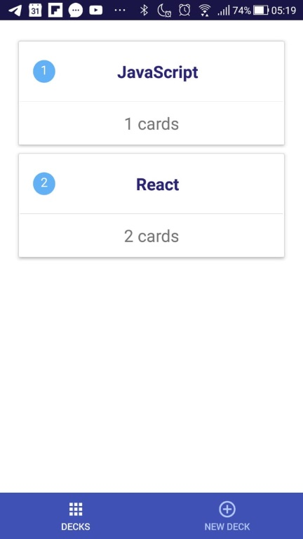
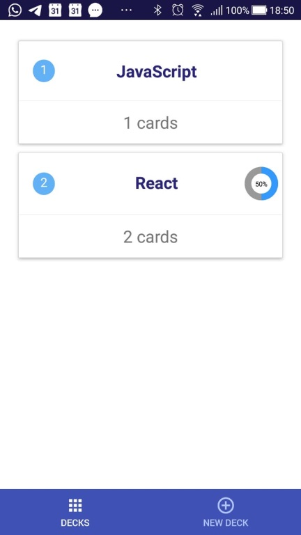
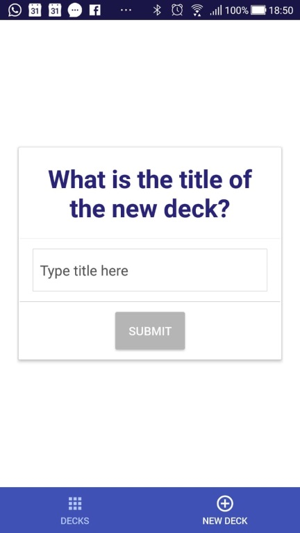

# React Native/Redux App - Flashcards
## Project Purpose
This mobile app (Android or iOS - or both) lets users study a collection of flashcards. 
With the app, users can create different categories of flashcards called "decks", add flashcards to these decks, and make the quizes in these decks.

## Tecnology
This native mobile app was built using React Native, Redux and NativeBase open source UI component library 

https://expo.io/@milsonei/mobile_flashcards

## Instalation
### Expo Cli
Expo CLI is a command line app that is the main interface between a developer and Expo tools
```
$ npm install -g expo-cli
```
### Project
In your Terminal(mac)/Command Line(Windows), enter the commands below
```
git clone https://github.com/milsonei/reactnd-project-mobile-flashcards.git

$ cd reactnd-project-mobile-flashcards

$ yarn install

$ yarn start OR $ expo start
```
## How to run
You need an simulator or a mobile device to run this app. The easiest way is to install Expo App on your mobile device then link to the app

[Expo on App Store](https://itunes.apple.com/br/app/expo-client/id982107779?mt=8) - iOS

[Expo on Google Play](https://play.google.com/store/apps/details?id=host.exp.exponent) - android

### Hosted version
You can run a hosted version of the app at [expo.io/@milsonei/mobile_flashcards/](https://expo.io/@milsonei/mobile_flashcards)

## How the app looks like

### Decks (Initial view of the app)


### After a quiz is completed, a progress circle is shown on the right side of the deck.


### New Deck


### New Card


### Start a quiz


### Show quiz question


### Show quiz answer


### Show the score


## Resources and Documentation:
- [NativeBase - Essential cross-platform UI components for React Native](https://docs.nativebase.io)
- [React Native Progress Circle](https://github.com/MrToph/react-native-progress-circle#readme)
- [React Native Router (v4.x)](https://github.com/aksonov/react-native-router-flux#readme)
- [React Native Animatable](https://github.com/oblador/react-native-animatable#readme)
- [React Native Flip Card](https://github.com/moschan/react-native-flip-card#readme)
- [React Native Progress Circle](https://github.com/MrToph/react-native-progress-circle#readme)
- [Redux](https://redux.js.org/introduction/getting-started)

## Udacity Resources:

- [Project Rubric](https://review.udacity.com/#!/rubrics/1215/view)
- [Udacity CSS Style Guide](http://udacity.github.io/frontend-nanodegree-styleguide/css.html)
- [Udacity HTML Style Guide](http://udacity.github.io/frontend-nanodegree-styleguide/index.html)
- [Udacity JavaScript Style Guide](http://udacity.github.io/frontend-nanodegree-styleguide/javascript.html)
- [Udacity Git Commit Message Style Guide](https://udacity.github.io/git-styleguide/)

_This project is licensed under the terms of the MIT license._